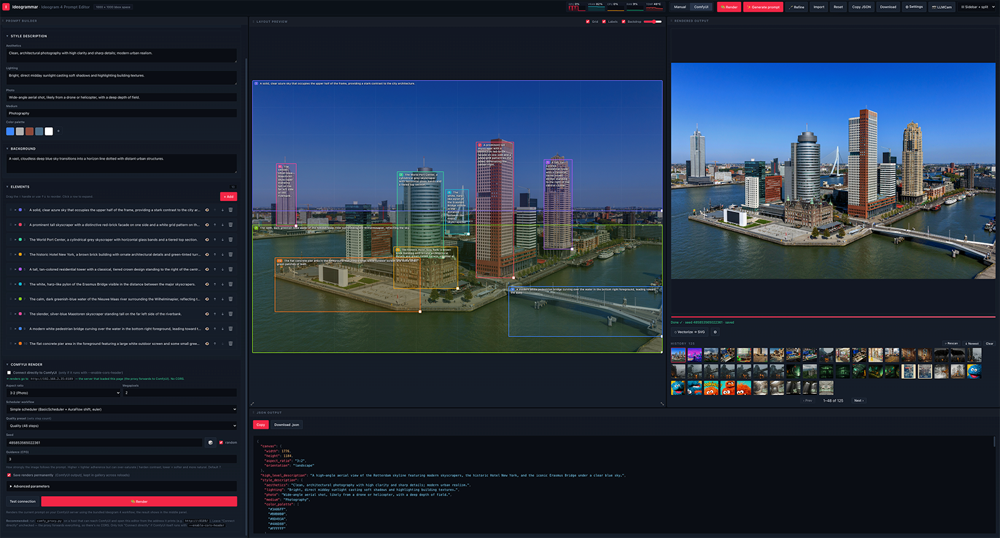
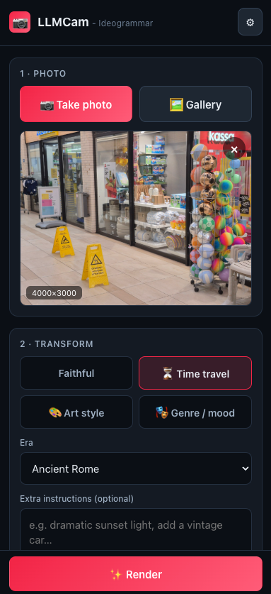

# Ideogrammar — Ideogram 4 Prompt Editor

A single-file, no-build web app for composing structured **Ideogram 4** prompts. You lay out a scene visually on a 1000×1000 canvas, describe each element, and the app emits the exact JSON the Ideogram 4 model expects. It can also generate a whole setup from a one-line description — or from an uploaded reference image — via an LLM, and — in **ComfyUI mode** — render the prompt on your own ComfyUI server and show the result inline.

It also ships **[LLMCam](#llmcam-mobile-camera-app)** — a phone-first companion app: snap a photo and it re-renders the scene through Ideogram with the same composition, optionally transformed (time travel, art style, genre…).

Everything lives in [`index.html`](index.html) (HTML + CSS + vanilla JS, no dependencies, no build step). [`comfy_proxy.py`](comfy_proxy.py) is an optional helper for ComfyUI mode, and [`llmcam.html`](llmcam.html) is the mobile camera app.



## Features

- **Tiled, draggable workspace** — the main area is a GridStack grid of resizable/draggable windows (Prompt builder, Layout canvas, JSON output, Rendered output). Drag a window by its title bar, resize from the edges; the arrangement is saved per browser. A header picker offers space-maximizing presets — *Sidebar + split* (builder sidebar, canvas + render side by side, JSON strip below), *Three columns*, *Render focus*, and *Quadrants*. GridStack is bundled locally (no CDN), served by the proxy.
- **Visual layout canvas** — drag/resize bounding boxes on a 1000×1000 grid (origin top-left). Each box is an element with a type, description, and color palette. The canvas reshapes to the selected aspect ratio.
- **Structured prompt builder** — high-level description, style block (aesthetics, lighting, photo, medium, palette), background, and a reorderable list of elements.
- **Preset color palettes** — a **🎨 Preset palettes** picker in the Style block opens ~30 curated, colorhunt-style 4-colour sets. Pick one and choose where it lands — just the image's style palette, or the whole image (which also clears per-element colours). Individual swatches stay editable afterwards.
- **Font-style picker** — `text` and `logo` elements get a typography picker: choose a preset style (each previewed in a matching, self-hosted web font — works fully offline) or type your own descriptor. The chosen style is injected into that element's prompt as a `font` field and round-trips through save/load and LLM refine.
- **Live JSON output** — syntax-highlighted, copy or download with one click.
- **Generate prompt** — describe the image in plain language, **or upload/drop a reference image** (with a vision-capable model), and an OpenAI-compatible LLM (OpenRouter or a local `llama.cpp` server) fills in the whole schema. Settings are stored in `localStorage`.
- **Refine** — ask the LLM to adjust the current setup with a plain-language change (e.g. "make it a lighter composition"); it rewrites the whole setup while keeping everything the request doesn't touch.
- **ComfyUI mode** — render the current prompt on your ComfyUI server using the bundled Ideogram 4 workflow, with every workflow parameter exposed and the result (plus live progress) shown in the editor. A **✕ Cancel** button interrupts a render in progress. Renders collect in a gallery with a full-size viewer, and can be saved permanently.
- **LoRA loader** — optionally apply a trained Ideogram 4 LoRA from the UI: tick **Apply LoRA**, pick a file (autocompleted from your ComfyUI's `models/loras/`), and set its strength. It's spliced into the workflow on the fly (model-only) and works with either scheduler; leave it off to render the base model.
- **RTX Super Resolution** — optionally upscale the render with NVIDIA's `RTXVideoSuperResolution` node before preview/save: tick **RTX Super Resolution** in the ComfyUI parameters, choose a quality preset (LOW–ULTRA) and a 1–4× scale. Spliced in on the fly like the LoRA; needs the `comfyui_nvidia_rtx_nodes` pack and an RTX GPU on the server.
- **GPU monitor** — live GPU-utilization and VRAM graphs in the top bar (ComfyUI mode), fed by the [Crystools](https://github.com/crystian/ComfyUI-Crystools) websocket; falls back to a VRAM-only graph if Crystools isn't installed.
- **LLMCam (mobile)** — a phone-first companion page ([`llmcam.html`](llmcam.html)): take a photo and re-render it through Ideogram keeping the composition, with one-tap transforms (faithful, time travel, art style, genre/mood) and Save/Share. See [below](#llmcam-mobile-camera-app).
- **Import / Reset / Download** — round-trip the prompt JSON.

## Quick start

Open `index.html` in a browser. That's it for the **Manual** workflow (build the prompt, copy/download the JSON, paste it into Ideogram or ComfyUI yourself).

## Modes

A toggle in the header switches between:

- **Manual** (default) — no server calls. Build the prompt and copy/download the JSON. Behaves exactly like a plain prompt editor.
- **ComfyUI** — adds a parameters panel and renders on your ComfyUI server, displaying the image inline.

## Prompt JSON shape

```json
{
  "high_level_description": "one vivid sentence describing the whole image",
  "style_description": {
    "aesthetics": "...", "lighting": "...", "photo": "...", "medium": "...",
    "color_palette": ["#RRGGBB", "..."]
  },
  "compositional_deconstruction": {
    "background": "...",
    "elements": [
      { "type": "obj|subject|text|logo|bg", "bbox": [x1, y1, x2, y2], "desc": "...", "color_palette": ["#RRGGBB"], "font": "optional — text/logo only" }
    ]
  }
}
```

Coordinates are a 1000×1000 space, origin top-left, `bbox = [x1, y1, x2, y2]`. `font` is optional and only carried for `text`/`logo` elements (a typography descriptor like *"bold geometric sans-serif lettering"*); it's omitted everywhere else.

## Settings (⚙)

The **⚙ Settings** button (header) opens one dialog for everything not tied to a specific render:

- **Text-generation model (LLM)** — provider (OpenRouter / local llama.cpp), base URL, API key, model, a **Detail** control (how many elements the model breaks the scene into, and how verbose each element's description is), and a **Temperature** slider (0–2, default 0.7 — higher = more varied output; some models ignore it). **Save named presets** of these so switching endpoints doesn't lose the model name — pick a preset from the dropdown to restore it. The same temperature setting applies to LLMCam.
- **Vectorizer** — mask method (SAM / heuristic / none) and flatness threshold.
- **Setups & library** — save/load/delete named **setups** (the full prompt builder state + render parameters).

## Generate prompt (LLM)

Configure a provider in **⚙ Settings** (OpenAI-compatible):

- **OpenRouter** — base URL `https://openrouter.ai/api/v1`, your API key, a model like `anthropic/claude-3.5-sonnet`.
- **Local llama.cpp** — run `llama-server` with CORS enabled; base URL `http://<host>:8081/v1`.
- **LM Studio** — start its local server (Developer tab → *Start Server*); base URL `http://<host>:1234/v1` (the default port is **1234**, not 8081), no API key. Pick the loaded model's name as the model.

Any other OpenAI-compatible endpoint works too — just set the base URL to the one ending in `/v1`. The app asks for a strict JSON response (`response_format: json_object`); servers that don't support that flag (e.g. LM Studio) are detected automatically and the request is retried without it, so it still works.

Then click **✨ Generate prompt**, describe the image, and the model returns the full schema, which you can edit visually. Settings/presets are saved in your browser only.

**From an image.** In the same dialog you can **click or drag-drop a reference image** instead of, or alongside, the text (large photos are downscaled automatically, so size isn't a concern). The model reads the image's subject, style, lighting, colors and any literal text, then reconstructs it as a full editable setup — estimating each element's position on the 1000×1000 canvas. The text box, when used together with an image, acts as extra guidance. This needs a **vision-capable model** (e.g. `anthropic/claude-3.5-sonnet`, `openai/gpt-4o`); a text-only model will reject the image.

## Refine (LLM)

Click **🪄 Refine** to adjust the *current* setup with a natural-language change instead of starting over. Describe a change (e.g. "make it a lighter composition", "move the title to the bottom", "swap the palette to autumn tones") and the model rewrites the **entire** setup — style, background and every positioned element — to reflect it while preserving everything the request doesn't touch. Per-element vectorize modes are carried over by position. Quick-suggestion chips are provided, plus the same **style presets** as LLMCam — *Time travel* (eras), *Art style*, *Genre / mood* — which fill in a composition-preserving change request. In ComfyUI mode a **🎨 Refine & Render** button applies the change and renders it in one step. You can also refine straight from a render: open it in the viewer and press **🪄 Refine** to load that render's setup and adjust it.

## LLMCam (mobile camera app)



[`llmcam.html`](llmcam.html) is a separate **phone-first** front-end served by the same proxy. Open `http://<lan-ip>:8189/llmcam.html` on your Android phone: **take a photo**, pick a transformation, and it runs the photo through the vision LLM (preserving the composition) and renders it through Ideogram on your ComfyUI server, then shows the result with **Save / Share**.

- **Capture** uses the phone's native camera (`<input capture>`) or the gallery — works over plain LAN HTTP (the live-camera API needs HTTPS, so it's intentionally not used).
- **Transformations**: *Faithful* (same scene, Ideogram render), *Time travel* (period-accurate eras), *Art style* (oil/anime/pixel/…), *Genre / mood* (cyberpunk/noir/fantasy/…), plus a free-text box. Each keeps the original composition and changes only what's depicted. The captured photo stays loaded, so you can pick a different transform and tap **Render** again to re-style the *same* shot — no re-capture.
- **Aspect** auto-matches the photo's orientation by default.
- **Before/after compare** — the full render shows first; drag across it to wipe back to the original photo.
- **Gallery** — every render is kept in a thumbnail strip; **tap one to load it as the subject** and re-render it in a different style (uses the original photo when available this session, otherwise the render itself). Permanently-saved renders persist across reloads (its own `localStorage`, separate from the editor's gallery).
- It **shares the same engine and `localStorage` config** as the main editor (both load [`llmcore.js`](llmcore.js); LLM provider/key/model, quality preset), and reaches ComfyUI through the proxy that served the page — so there's nothing extra to configure if the main app already works on that device. Needs a **vision-capable** model.

## Setups & library

A **setup** is the whole prompt builder state (description, style, background, positioned elements with per-element vectorize modes) plus the render parameters. Save the current one from **⚙ Settings → Setups & library**, and reload it anytime. Loading a setup also restores its **rendered image** in the preview window (the render it produced, if still available on the server; older setups fall back to matching a render in the gallery). Every render also captures its setup: open it in the viewer and press **⤵ Load setup** to restore exactly the prompt + settings that produced it. Stored in `localStorage`.

## ComfyUI mode

ComfyUI mode renders the current prompt on your server with the bundled Ideogram 4 workflow ([`workflow.json`](workflow.json), embedded in the page). The left panel exposes every meaningful parameter — connection (proxy vs. direct), scheduler workflow, aspect ratio, megapixels, quality preset (Quality/Default/Turbo), seed (+ randomize), guidance CFG, sampler, CFG-override, batch size, and the diffusion / unconditional / VAE / CLIP model names. The **scheduler workflow** selector switches between the stock *Ideogram 4 default* (`Ideogram4Scheduler`) and a community *simple scheduler* variant (`ModelSamplingAuraFlow` shift + `BasicScheduler` "simple" + euler), which some find gives better results; switching also sets the matching recommended sampler. The editor's prompt JSON is injected into the positive-prompt node on every render. Results and live progress appear in the middle panel, and **✕ Cancel** interrupts a running render (it calls ComfyUI's `/interrupt` and drops the job from the queue). A **Test connection** button reports whether the server is reachable (and its version) or what's wrong.

**LoRA (optional).** In *Advanced parameters* there's an **Apply LoRA** toggle. Enable it, pick a LoRA file (the field autocompletes from the connected server's `models/loras/` once you've run **Test connection**, or just type the filename including any subfolder), and set the **Strength** (1.0 = full effect, lower softens it, negative inverts). When enabled, a `LoraLoaderModelOnly` node is spliced between the diffusion model and its consumer — so it works with both scheduler variants — patching only the conditioned diffusion model; the unconditional/negative model and the text encoder are left untouched (the usual shape for Ideogram 4 diffusion LoRAs). The setting is saved with **setups** like every other render parameter.

**RTX Super Resolution (optional).** Below the LoRA toggle, **RTX Super Resolution** runs NVIDIA's `RTXVideoSuperResolution` node on the decoded image before it reaches Preview/Save — spliced in the same way as the LoRA (it repoints whatever consumes the VAE-decode output, so it works whether you're previewing or saving). Pick a **Quality** preset (LOW / MEDIUM / HIGH / ULTRA) and a **Scale** factor (1–4×, default 2). It needs the [`comfyui_nvidia_rtx_nodes`](https://github.com/nvidia/ComfyUI-nvidia-rtx-nodes) custom-node pack and an RTX GPU on the ComfyUI host; leave it off to output at the rendered resolution. Saved with **setups** like every other render parameter.

The middle panel also reshapes to the selected **aspect ratio** so the layout preview matches the real canvas. You lay boxes out in the editor's normalized `0–1000` space, but when a render is sent the prompt's bounding boxes are scaled into the **actual output pixel dimensions** and the text is prefixed with an explicit **orientation cue** (e.g. *"LANDSCAPE … 1776×1184 … do not rotate or mirror"*). This keeps the model's frame, the latent size, and the layout coordinates consistent — without it the model tends to squash the layout or rotate the result ~90°.

**Vectorize to SVG (local, experimental).** The **⬡ Vectorize → SVG** button (in the Rendered output tile, and in the full-image viewer for any gallery item) converts a render to a *hybrid* SVG: flat regions (text, logos, and `obj` regions that pass a flatness heuristic) are traced to vector paths with [VTracer](https://github.com/visioncortex/vtracer); photographic regions (`subject`, `bg`) stay as an embedded raster base. Routing uses the element types from the prompt plus a per-region reconstruction-error test. Each vector overlay is **clipped to the element's actual shape** (so vector text sits over the photo as glyphs, not as a rectangle) using a mask — **SAM if you've configured it**, otherwise a built-in foreground heuristic. The result opens in the viewer with a download link.

The **⚙ settings** dialog (next to the Vectorize button) lets you pick the **mask method** — SAM, the foreground heuristic (the older, faster method), or no masking (trace the whole box) — and a **flatness threshold** for `Auto` regions. For finer control, each element card has a **Vectorize** dropdown: *Auto (by type)*, *Always vector*, or *Never (keep raster)* — handy when the automatic routing vectorizes the wrong part.

This runs in `comfy_proxy.py`'s `/vectorize` endpoint and needs extra Python packages on the proxy host (kept in a venv; the proxy lazily imports them, so the rest of the app is unaffected if they're absent):

```bash
python3 -m venv .venv
.venv/bin/pip install vtracer pillow opencv-python-headless numpy
# point the service at that interpreter:
PYTHON="$PWD/.venv/bin/python" ./comfy_proxy.sh install-service
```

Photoreal subjects don't meaningfully vectorize (kept raster by design), so output is a mixed vector+raster SVG.

#### Optional: higher-quality masks via Segment Anything (SAM)

If `SAM_CHECKPOINT` is set, the proxy uses [SAM](https://github.com/facebookresearch/segment-anything) for region masks instead of the built-in foreground heuristic. Install it into the same venv and download a checkpoint:

```bash
# CPU build of PyTorch (~200 MB) — simplest, no CUDA matching needed
.venv/bin/pip install torch torchvision --index-url https://download.pytorch.org/whl/cpu
.venv/bin/pip install "git+https://github.com/facebookresearch/segment-anything.git"

# vit_b checkpoint (~358 MB), smallest/fastest
mkdir -p models
curl -L -o models/sam_vit_b_01ec64.pth \
  https://dl.fbaipublicfiles.com/segment_anything/sam_vit_b_01ec64.pth
```

Then tell the proxy where the checkpoint is. The env vars must reach the **proxy process**, and how depends on how you run it:

**Easiest (works for every run mode)** — put them in `comfy_proxy.env` (the same untracked file used for `COMFY_URL`; `comfy_proxy.sh` sources it on `start`/`restart` and `install-service` picks it up too):

```bash
cat >> comfy_proxy.env <<EOF
SAM_CHECKPOINT=$PWD/models/sam_vit_b_01ec64.pth
SAM_MODEL_TYPE=vit_b
EOF
./comfy_proxy.sh restart        # or: install-service
```

**As a background service** — `install-service` bakes the vars into the systemd unit when they're set in the environment, so they persist across reboots:

```bash
SAM_CHECKPOINT="$PWD/models/sam_vit_b_01ec64.pth" SAM_MODEL_TYPE=vit_b \
  PYTHON="$PWD/.venv/bin/python" ./comfy_proxy.sh install-service
```

**Running the Python directly** — just export them in the same shell first:

```bash
export SAM_CHECKPOINT="$PWD/models/sam_vit_b_01ec64.pth" SAM_MODEL_TYPE=vit_b
.venv/bin/python comfy_proxy.py --comfy http://127.0.0.1:8188 --port 8189
```

> **Use an absolute path** for `SAM_CHECKPOINT` (the service has a different working directory), and make sure `SAM_MODEL_TYPE` matches the checkpoint you downloaded (`vit_b` / `vit_l` / `vit_h`).

**Verify it's working.** On startup the proxy prints its mask backend, e.g. `vectorize masks: SAM configured (vit_b, …) — loads on first vectorize`. SAM loads lazily on the first **⬡ Vectorize**, and that's when you'll see a `[sam] loaded SAM (vit_b) on cuda …` line — or, if something's off, a `[sam] …` line saying exactly why (missing dep, wrong path, model-type mismatch). Watch the log with `./comfy_proxy.sh logs`. On any failure SAM falls back to the foreground heuristic, so the feature never hard-breaks — it just won't be using SAM, and the log now tells you why.

> **Speed (CPU):** the CPU build is not fast — the first vectorize after a (re)start pays a one-time model-load cost (~a minute), and each region then takes a few seconds. Fine for an occasional manual action. For GPU speed (it shares the card with ComfyUI; the code auto-selects CUDA when available), install a CUDA build instead and restart:
>
> ```bash
> .venv/bin/pip install torch torchvision --index-url https://download.pytorch.org/whl/cu121  # match your CUDA
> systemctl --user restart comfy_proxy.service
> ```
>
> `vit_l` / `vit_h` checkpoints give sharper masks at higher cost. `models/` and `.venv/` are gitignored.

**Gallery & saving.** Every render is added to a **History** strip below the result; click the result image or any thumbnail to open a full-size **viewer modal** with prev/next (arrow keys), **rotate 90° CW/CCW** (saved per item; applied to the view, the download, the gallery thumbnail, and vectorize), seed/aspect info, and a download link. When a render was generated **from a reference image**, the viewer also shows a **before/after compare slider** — drag across it to wipe between the original image and the render. The reference image is **cached on the proxy** (a small content-addressed file under `--ref-dir`) and the browser keeps only a short key, so the slider persists across reloads and isn't limited by `localStorage` size; named setups store the same key. In direct-to-ComfyUI mode (no proxy) it falls back to keeping the image in the browser for the session. The strip is scrollable and has a **↓ Newest / ↑ Oldest** toggle that sorts by creation date. By default renders are ComfyUI **temp** files, so the gallery is session-only. Tick **Save renders permanently** to switch the output node to `SaveImage` (files land in ComfyUI's `output/` as `ideogrammar_*.png`); those renders persist in the gallery across reloads (stored in `localStorage`, up to 300). **Clear** empties the gallery list only — it never deletes files from `output/`.

**Recovering renders (⟳ Rescan).** If the gallery list gets out of sync with what's actually on disk (e.g. it was trimmed, cleared, or opened in another browser), **⟳ Rescan** in the History header rebuilds it. It merges two sources, deduped by filename: (1) **ComfyUI's `/history`** — every render the running ComfyUI still remembers, including seed, aspect and the full setup (from the prompt graph); and (2) a **disk scan** of ComfyUI's `output/` folder via the proxy, which survives a ComfyUI restart. The disk scan reads seed/aspect/setup back out of each PNG's embedded `prompt` metadata and orders by file mtime. It only runs when the proxy is started with `--output-dir` pointing at a readable `output/` folder (see below); without it, Rescan falls back to `/history` alone.

### GPU monitor

In ComfyUI mode the top bar shows two live sparklines — **GPU** (compute utilization) and **VRAM** (memory used) — so you can watch the card while it renders. The data comes from the [**Crystools**](https://github.com/crystian/ComfyUI-Crystools) extension, which broadcasts a `crystools.monitor` message (utilization, temperature, VRAM) over ComfyUI's websocket about once a second. Install it on your ComfyUI server (via ComfyUI-Manager, or clone it into `ComfyUI/custom_nodes/` and restart):

```bash
cd ComfyUI/custom_nodes
git clone https://github.com/crystian/ComfyUI-Crystools.git
# then restart ComfyUI
```

Crystools is **optional**: without it, the GPU graph shows `n/a` and the VRAM graph still works (polled from ComfyUI's built-in `/system_stats`, which reports memory but not utilization). The monitor polls only while you're in ComfyUI mode and the tab is visible.

### The CORS problem (and why the proxy exists)

A browser will not let a page read responses from a **different origin** unless that server sends CORS headers. ComfyUI sends none by default. (Server-to-server clients — like a Python script using `httpx` — never hit this, because CORS is a browser-only rule.) So a browser page that loads from one place and calls ComfyUI somewhere else is blocked.

The proxy fixes this by being **both** the web server that serves the editor **and** the forwarder to ComfyUI — so the browser only ever talks to *one* origin. The editor defaults to talking to whatever origin served it, so when you open it *through the proxy*, it just works.

**Option A — run the bundled proxy (recommended; no ComfyUI changes):**

Use the start/stop helper on a host that can reach ComfyUI:

```bash
./comfy_proxy.sh start      # start (listens on 0.0.0.0:8189, forwards to ComfyUI)
./comfy_proxy.sh status     # is it running? what address?
./comfy_proxy.sh stop
./comfy_proxy.sh restart
./comfy_proxy.sh logs       # tail the log
```

It prints the address to open, e.g. `http://<lan-ip>:8189/`. Open **that** address in your browser (from any machine on the LAN), switch to **ComfyUI** mode, and leave **"Connect directly to ComfyUI" unchecked**. The green line under it confirms renders go to the proxy. The proxy forwards all API calls + the `/ws` progress WebSocket, so there's no CORS.

Override defaults with environment variables:

```bash
COMFY_URL=http://0.0.0.0:8188 PROXY_HOST=0.0.0.0 PROXY_PORT=8189 ./comfy_proxy.sh start
```

**Local config file (recommended).** Instead of typing the variables each time, copy `comfy_proxy.env.example` to `comfy_proxy.env` and set your real ComfyUI address there. Both `comfy_proxy.sh` and `comfy_proxy.py` load it automatically (a pre-set environment variable still wins), and it's **gitignored** so your server IP never lands in the repo:

```bash
cp comfy_proxy.env.example comfy_proxy.env
# edit comfy_proxy.env -> COMFY_URL=http://<your-comfyui-host>:8188
./comfy_proxy.sh start
```

Override the path with `COMFY_PROXY_ENV=/path/to/file`.

Or run the Python directly (same effect, no PID/log management):

```bash
python comfy_proxy.py --comfy http://0.0.0.0:8188 --host 0.0.0.0 --port 8189
```

| Flag | Default | Purpose |
|------|---------|---------|
| `--comfy URL` | `http://127.0.0.1:8188` | ComfyUI base URL |
| `--host ADDR` | `127.0.0.1` | bind address (`0.0.0.0` to expose on LAN) |
| `--port N` | `8189` | port to serve on |
| `--html PATH` | `./index.html` | page to serve |
| `--output-dir PATH` | _(unset)_ | ComfyUI's `output/` folder, readable by the proxy — enables gallery recovery (**⟳ Rescan**) from disk, surviving ComfyUI restarts |
| `--ref-dir PATH` | `./.ideogrammar_refimg` | where to cache reference images for the before/after compare slider (env: `IDEOGRAMMAR_REF_DIR`) |
| `--verbose` | off | log every request |

> `--output-dir` only works when the proxy can read that folder directly (i.e. it runs on the ComfyUI host or has the folder network-mounted). It's read-only — the proxy lists files and parses PNG metadata; it never writes or deletes.

Both are stdlib-only (Python 3.8+) — nothing to install.

> **Common mistake:** serving the editor with a *plain* static server (e.g. `python -m http.server`) and opening that. A static server hands out `index.html` but 404s on `/system_stats`, `/prompt`, etc. — so renders fail. The editor must be served by `comfy_proxy.py`, which forwards those calls.

#### Run it as a background service (systemd, survives logout/reboot)

```bash
./comfy_proxy.sh install-service     # install + enable + start (per-user, no sudo)
```

This writes a systemd **user** unit, enables it at boot, starts it, and turns on linger so it keeps running when you log out. Manage it with standard systemd:

```bash
systemctl --user status  comfy_proxy.service
systemctl --user restart comfy_proxy.service
systemctl --user stop    comfy_proxy.service
journalctl --user -u comfy_proxy.service -f      # live logs
./comfy_proxy.sh uninstall-service               # remove it
```

Set host/port/target at install time with the same env vars:

```bash
COMFY_URL=http://127.0.0.1:8188 PROXY_HOST=0.0.0.0 PROXY_PORT=8189 ./comfy_proxy.sh install-service
```

For a **system-wide** service instead (starts at boot regardless of any login; uses sudo):

```bash
SERVICE_SCOPE=system ./comfy_proxy.sh install-service
# manage with: sudo systemctl {status|restart|stop} comfy_proxy.service
```

**Option B — connect directly (enable CORS in ComfyUI):**

```bash
python main.py --listen --enable-cors-header
```

Then in the editor, tick **"Connect directly to ComfyUI"** and enter its URL (e.g. `http://127.0.0.1:8188`). No proxy needed in this mode.

### Test connection

The **Test connection** button in the ComfyUI panel pings `/system_stats` and reports whether the server is reachable (and its ComfyUI version), or explains what's wrong (down / wrong URL / CORS-blocked).

## Files

| File | Purpose |
|------|---------|
| [`index.html`](index.html) | The main app — editor, canvas, LLM generation, ComfyUI mode. |
| [`llmcore.js`](llmcore.js) | Shared engine for both pages: ComfyUI workflow template, resolution/prompt building, the LLM call, config, and the render plumbing. Loaded by `index.html` and `llmcam.html`. |
| [`llmcam.html`](llmcam.html) | Phone-first camera app — take a photo, transform it (time travel / art style / genre / faithful), render through Ideogram, with a gallery and save/share. Served by the proxy at `/llmcam.html`. |
| [`comfy_proxy.py`](comfy_proxy.py) | Stdlib proxy: serves the page + local asset files (e.g. `vendor/`), forwards HTTP and the WebSocket to ComfyUI (same-origin, no CORS flags), and hosts the `/vectorize` endpoint (optional `vtracer`/`pillow` deps), `/ideogrammar/outputs` (gallery recovery; needs `--output-dir`), and `/ideogrammar/refimg` (content-addressed cache of reference images for the compare slider; under `--ref-dir`). |
| [`comfy_proxy.sh`](comfy_proxy.sh) | start/stop/status/restart/logs helper, plus `install-service`/`uninstall-service` to run it as a background systemd service. |
| [`comfy_proxy.env.example`](comfy_proxy.env.example) | Template for `comfy_proxy.env` (untracked) — set your ComfyUI address/host/port there instead of in the tracked code. |
| [`workflow.json`](workflow.json) | The Ideogram 4 ComfyUI workflow (API format) the render mode is built around; also embedded in `index.html`. |
| [`vendor/`](vendor/) | Bundled third-party assets served locally by the proxy, so the app works without a CDN: GridStack JS/CSS, and `vendor/fonts/` — a self-hosted latin subset of the font-style preview fonts (woff2 + generated `fonts.css`). |

## Notes

- Rendered images come back as ComfyUI `temp` files (from the `PreviewImage` node); the editor handles that automatically.
- LLM and ComfyUI settings persist in `localStorage` (per browser).
- Works over plain HTTP on a LAN; clipboard copy falls back to a manual path on insecure origins.
